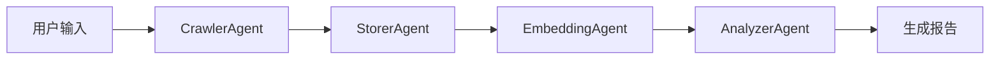
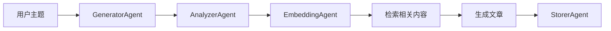
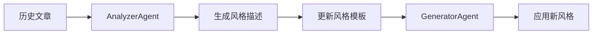

# 微信公众号Agent系统架构设计

## 设计理念
基于模块化Agent设计，每个Agent职责单一，便于在Dify等低代码平台上组装和复用。

## Agent模块设计

### 1. Agent_Crawler (爬虫Agent)
**职责**: 专门负责微信公众号文章爬取

**核心功能**:
```python
# 伪代码：爬虫Agent接口
class CrawlerAgent:
    def crawl_articles(self, account_name: str, max_count: int = 10) -> List[Article]:
        """爬取指定公众号的文章"""
        pass
    
    def crawl_single_article(self, article_url: str) -> Article:
        """爬取单篇文章"""
        pass
    
    def get_article_list(self, account_name: str) -> List[ArticleMeta]:
        """获取文章列表（不下载内容）"""
        pass
```

**输入输出**:
- **输入**: 公众号名称、爬取数量、文章URL
- **输出**: 文章对象列表（包含标题、内容、图片链接等）
- **状态**: 爬取进度、成功/失败统计

**Dify集成**:
- 可作为工具函数集成
- 支持定时触发
- 提供爬取状态监控

### 2. Agent_Storer (存储Agent)
**职责**: 管理数据存储，支持多种存储后端

**核心功能**:
```python
# 伪代码：存储Agent接口
class StorerAgent:
    def save_articles(self, articles: List[Article], storage_type: str = "local") -> bool:
        """保存文章到指定存储"""
        pass
    
    def load_articles(self, filters: Dict = None) -> List[Article]:
        """从存储加载文章"""
        pass
    
    def update_article(self, article_id: str, updates: Dict) -> bool:
        """更新文章信息"""
        pass
    
    def delete_article(self, article_id: str) -> bool:
        """删除文章"""
        pass
```

**存储后端支持**:
- **本地文件**: JSON + 图片文件
- **MongoDB**: 文档数据库
- **Elasticsearch**: 搜索引擎
- **MinIO/S3**: 对象存储

**Dify集成**:
- 可作为知识库数据源
- 支持数据同步和备份
- 提供数据查询接口

### 3. Agent_Embedding (向量化Agent)
**职责**: 生成文本嵌入向量，管理向量数据库

**核心功能**:
```python
# 伪代码：向量化Agent接口
class EmbeddingAgent:
    def generate_embeddings(self, texts: List[str]) -> List[List[float]]:
        """生成文本嵌入向量"""
        pass
    
    def store_vectors(self, vectors: List[List[float]], metadata: List[Dict]) -> bool:
        """存储向量到向量数据库"""
        pass
    
    def search_similar(self, query: str, top_k: int = 5) -> List[Dict]:
        """相似度搜索"""
        pass
    
    def update_embeddings(self, article_ids: List[str]) -> bool:
        """更新指定文章的嵌入向量"""
        pass
```

**向量数据库支持**:
- **ChromaDB**: 本地向量数据库
- **Qdrant**: 高性能向量数据库
- **Pinecone**: 云端向量数据库
- **Weaviate**: 图向量数据库

**Dify集成**:
- 可作为RAG知识库
- 支持语义搜索
- 提供相似内容推荐

### 4. Agent_Analyzer (分析Agent)
**职责**: 分析文章特征，生成个性化风格描述

**核心功能**:
```python
# 伪代码：分析Agent接口
class AnalyzerAgent:
    def analyze_writing_style(self, articles: List[Article]) -> StyleProfile:
        """分析写作风格"""
        pass
    
    def extract_features(self, article: Article) -> ArticleFeatures:
        """提取文章特征"""
        pass
    
    def generate_style_prompt(self, style_profile: StyleProfile) -> str:
        """生成风格描述提示词"""
        pass
    
    def classify_content(self, article: Article) -> ContentCategory:
        """内容分类"""
        pass
```

**分析维度**:
- **词汇特征**: 常用词汇、词汇丰富度
- **句式结构**: 句子长度、句式类型
- **情感倾向**: 情感分析、语调特征
- **写作习惯**: 引用使用、数据引用、问句使用
- **主题偏好**: 领域分类、关键词分布

**Dify集成**:
- 可作为内容分析工具
- 提供风格模板生成
- 支持个性化配置

### 5. Agent_Generator (生成Agent)
**职责**: 根据风格特征和主题生成新内容

**核心功能**:
```python
# 伪代码：生成Agent接口
class GeneratorAgent:
    def generate_article(self, topic: str, style_profile: StyleProfile) -> Article:
        """生成文章"""
        pass
    
    def generate_outline(self, topic: str) -> List[str]:
        """生成文章大纲"""
        pass
    
    def generate_section(self, section_title: str, context: str) -> str:
        """生成文章段落"""
        pass
    
    def optimize_content(self, content: str, feedback: str) -> str:
        """根据反馈优化内容"""
        pass
```

**生成策略**:
- **Few-shot Learning**: 基于示例文章生成
- **Prompt Engineering**: 动态构建提示词
- **RAG增强**: 结合知识库内容
- **迭代优化**: 基于反馈持续改进

**Dify集成**:
- 可作为内容生成工具
- 支持多种生成模式
- 提供质量评估接口

## Agent协作流程

### 1. 数据采集流程


### 2. 内容生成流程


### 3. 风格学习流程


## Dify平台集成方案

### 1. 工具函数集成
```python
# 每个Agent可以作为Dify的工具函数
tools = {
    "crawl_wechat_articles": CrawlerAgent.crawl_articles,
    "save_articles": StorerAgent.save_articles,
    "generate_embeddings": EmbeddingAgent.generate_embeddings,
    "analyze_style": AnalyzerAgent.analyze_writing_style,
    "generate_content": GeneratorAgent.generate_article
}
```

### 2. 知识库集成
- **StorerAgent**: 作为数据源
- **EmbeddingAgent**: 作为向量搜索
- **AnalyzerAgent**: 作为内容分析

### 3. 工作流集成
```python
# Dify工作流示例
workflow = {
    "name": "微信公众号内容生成",
    "steps": [
        {"agent": "CrawlerAgent", "action": "crawl_articles"},
        {"agent": "StorerAgent", "action": "save_articles"},
        {"agent": "EmbeddingAgent", "action": "generate_embeddings"},
        {"agent": "AnalyzerAgent", "action": "analyze_style"},
        {"agent": "GeneratorAgent", "action": "generate_article"}
    ]
}
```

## 实现优先级

### MVP阶段 (1周)
1. **CrawlerAgent**: 基础爬虫功能
2. **StorerAgent**: 本地文件存储
3. **AnalyzerAgent**: 简单特征提取
4. **GeneratorAgent**: 基础内容生成

### POC阶段 (2-3周)
1. **EmbeddingAgent**: 向量化功能
2. **StorerAgent**: MongoDB集成
3. **AnalyzerAgent**: 高级风格分析
4. **GeneratorAgent**: RAG增强生成

### 生产阶段 (2-3周)
1. 性能优化
2. 错误处理完善
3. Dify平台集成
4. 监控和告警

## 技术架构

### 目录结构
```
wx_agent/
├── agents/
│   ├── crawler_agent.py
│   ├── storer_agent.py
│   ├── embedding_agent.py
│   ├── analyzer_agent.py
│   └── generator_agent.py
├── core/
│   ├── base_agent.py      # Agent基类
│   ├── agent_manager.py   # Agent管理器
│   └── workflow.py        # 工作流引擎
├── models/
│   ├── article.py
│   ├── style_profile.py
│   └── agent_config.py
├── utils/
│   ├── logger.py
│   ├── config.py
│   └── exceptions.py
└── dify_integration/
    ├── tools.py           # Dify工具函数
    ├── workflows.py       # Dify工作流
    └── knowledge_base.py  # Dify知识库
```

### Agent基类设计
```python
# 伪代码：Agent基类
class BaseAgent:
    def __init__(self, config: Dict):
        self.config = config
        self.logger = self.setup_logger()
    
    def execute(self, input_data: Any) -> Any:
        """执行Agent任务"""
        try:
            result = self._process(input_data)
            self.logger.info(f"Agent {self.__class__.__name__} executed successfully")
            return result
        except Exception as e:
            self.logger.error(f"Agent {self.__class__.__name__} failed: {e}")
            raise
    
    def _process(self, input_data: Any) -> Any:
        """子类实现具体处理逻辑"""
        raise NotImplementedError
    
    def get_status(self) -> Dict:
        """获取Agent状态"""
        return {
            "agent_name": self.__class__.__name__,
            "status": "running",
            "last_execution": datetime.now()
        }
```

## 总结

您的模块化Agent设计思路非常正确，这种架构具有以下优势：

1. **高度模块化**: 每个Agent职责清晰，便于开发和维护
2. **易于扩展**: 新增功能只需添加新的Agent
3. **平台兼容**: 完美适配Dify等低代码平台
4. **可复用性强**: Agent可以在不同场景下组合使用
5. **便于测试**: 每个模块可以独立测试

建议按照这个架构开始实现，先从MVP阶段的4个核心Agent开始，然后逐步完善功能。 